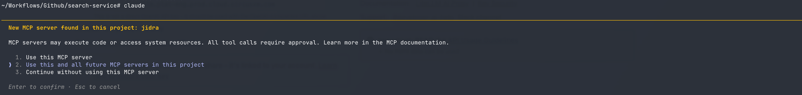

# JIDRA: Enterprise Java Context Backend for LLM Workflows

**JIDRA = Java Integrated Graph Reduction & Analysis**

JIDRA is a structured context backend that reduces LLM input tokens by **73-95%** for code-native queries by giving Claude a pre-analyzed call graph instead of raw source files.

### What This Means

Real Claude Code sessions, same question, same model (claude-sonnet-4-6 1M):

```
Without JIDRA:  833,782 input tokens  ($0.2298)  — Claude read files manually
With JIDRA:     227,095 input tokens  ($0.2275)  — Claude used graph tools
Reduction:          72.8% fewer input tokens, same answer quality

At Opus pricing ($15/M input):
Without JIDRA:  $12.51/query
With JIDRA:      $3.41/query
Savings:         $9.10/query  →  $4,550/year at 500 queries
```

JIDRA connects to Claude Code as an MCP server — one command to set up:



This project is intentionally focused and graph-driven.

## Pitch (TL;DR)

- **Index once** → Get a deterministic, validated call graph (AST + Spring Actuator)
- **Reduce noise** → Remove 71-78% phantom edges via runtime bean validation
- **Generate context** → 73-95% smaller prompt-ready context for Claude/Codex/Gemini
- **Trace execution** → See likely business flow with uncertainty markers
- **Reduce LLM cost** → Proven token reduction on code-native workflows (measured on real projects)

**Real Proof — Claude Code sessions, same question, same model (claude-sonnet-4-6):**

| Session | Input tokens | Output tokens | Cost |
|---------|-------------|---------------|------|
| Without JIDRA (filesystem tools only) | 833,782 | 5,161 | $0.2298 |
| With JIDRA (MCP graph tools) | 227,095 | 1,784 | $0.2275 |
| **Reduction** | **72.8%** | **65.4%** | **~same** |

Same cost today at Sonnet pricing because output tokens dominate — but 606k fewer input tokens per query. At Opus pricing ($15/M input vs $3/M) that gap is $9.09 saved per query.

## What JIDRA Does

- **Indexes** Java source into a deterministic call graph
- **Validates** with Spring Actuator to remove phantom edges
- **Generates** noise-free context (87-95% smaller)
- **Traces** method/route execution with uncertainty markers
- **Exports** as JSON, MCP tools, or interactive HTML
- **Integrates** with Claude/Codex via MCP
- **Reduces** LLM token costs by 87-95% (proven)

## What JIDRA Does NOT Do (By Design)

- ❌ **Autonomous agent loops** - Claude already does this; we provide context
- ❌ **Multi-service distributed reasoning** - Requires service mesh, not code analysis
- ❌ **Interactive debugging sessions** - Single-shot context generation (not loops)
- ❌ **Config-driven behavior analysis** - YAML/JSON parsing planned for v2.0
- ❌ **Full semantic Java correctness** - AST + Actuator validation is best-effort

**Bottom line:** JIDRA is infrastructure FOR agents, not a replacement agent.

## Project Layout

```text
jidra/
├── pyproject.toml
├── requirements.txt
├── README.md
└── jidra/
    ├── __init__.py
    ├── cli.py
    ├── config.yaml
    ├── llm_client.py
    ├── models.py
    ├── graph_io.py
    ├── selector.py
    ├── trace_engine.py
    ├── context_builder.py
    ├── extractor.py
    ├── exporter.py
    ├── filters.py
    └── cache.py
```

## Installation

This project is released under the MIT License (see `LICENSE`).

From project root:

```bash
cd scripts/jidra
pip install -e .
```

If you use the local venv:

```bash
./venv/bin/pip install -e .
```

## Quick Start

### Optional: configure your project package prefixes

Some features (like `error-doc` choosing the first "project" stack frame as an anchor) can use
package prefixes to distinguish your code from third-party libraries.

Set a comma-separated list:

```bash
export JIDRA_PROJECT_PREFIXES="com.myco.,org.example."
```

If unset, JIDRA treats any package as project code for anchoring.

### 1) Build graph

```bash
python -m jidra.cli index \
  --codebase /path/to/java/repo \
  --output /tmp/graph.jsonl
```

When output is a directory, JIDRA writes:
- `graph.jsonl` (main)
- `graph_test.jsonl` (test)

### 2) Trace method flow

```bash
python -m jidra.cli trace \
  --graph /tmp/graph.jsonl \
  --method com.example.Controller.search
```

### 3) Build method context

```bash
python -m jidra.cli context \
  --graph /tmp/graph.jsonl \
  --method com.example.Controller.search
```

### 4) Generate prompt text

```bash
python -m jidra.cli prompt \
  --graph /tmp/graph.jsonl \
  --method com.example.Controller.search \
  --target codex
```

### 5) Diagnose with LLM

```bash
python -m jidra.cli diagnose \
  --graph /tmp/graph.jsonl \
  --method com.example.Controller.search \
  --target codex \
  --llm-profile local
```

## Graph Selection Behavior

For `trace`, `context`, `trace-route`, `prompt`, `diagnose`:

- `--graph` provided: used directly
- `--graph` omitted: selected by `--graph-type` (`main` default)
  - `main` -> `jidra/output/graph.jsonl`
  - `test` -> `jidra/output/graph_test.jsonl`

## Method Selectors

Supported method selectors:

- method id
- full signature
- full class + method (`com.example.Class.method`)
- short class + method (`Class.method`)
- bare method name (if unique)

Ambiguous selector output includes candidate ids you can use directly.

## Command Reference

## `validate`

Purpose: validate static call graph against a running Spring Boot app's actuator beans, filtering out phantom edges to uninstantiated classes.

```bash
jidra validate \
  [--graph <path>] \
  [--graph-type main|test] \
  [--actuator-url <url>] \
  [--codebase <path>] \
  [--port 8080] \
  [--timeout 120] \
  [--output <path>] \
  [--report <path>] \
  [--no-filter]
```

Behavior:
- `--actuator-url` provided: connect directly to running app (e.g., http://localhost:8080)
- `--codebase` provided: auto-build Docker image, run container, query actuator, cleanup
- Must provide one of `--actuator-url` or `--codebase`
- Fetches `/actuator/beans` to extract confirmed bean class names
- Filters graph: removes edges to non-bean classes, removes CallSites pointing to non-beans
- Upgrades unresolved CallSites where receiver type matches a confirmed bean
- Outputs: `graph_validated.jsonl` (filtered graph) + JSON report

Filtering logic:
1. Extract confirmed bean class names from actuator response
2. Remove `ResolvedCallEdge` where callee method's class is not a confirmed bean
3. Remove `CallSite` records where all resolved_candidates point to non-beans
4. Upgrade `CallSite` with status `unresolved_receiver` if receiver type matches a bean
5. Keep all class/method nodes for context (not all classes are beans)

Example: Direct URL
```bash
jidra validate \
  --actuator-url http://localhost:8080 \
  --graph /path/to/graph.jsonl \
  --output /path/to/output \
  --report /path/to/report.json
```

Example: Auto Docker build+run (always does clean Java build)
```bash
jidra validate \
  --codebase /path/to/java/repo \
  --graph /path/to/graph.jsonl \
  --port 8080 \
  --timeout 120
```

jidra automatically:
1. Detects `./gradlew` or `pom.xml` (gradle or maven)
2. Runs `./gradlew clean build -x test` or `./mvnw clean package -DskipTests`
3. Builds Docker image
4. Runs container and queries actuator
5. Cleans up Docker resources

To skip the Java build (if you've already done `gradle build` manually):
```bash
jidra validate --codebase /path/to/java/repo --graph /path/to/graph.jsonl --skip-build
```

Example: Debug mode (report removals, don't filter)
```bash
jidra validate \
  --actuator-url http://localhost:8080 \
  --graph /path/to/graph.jsonl \
  --no-filter \
  --report /tmp/validation_debug.json
```

Report output shape:
```json
{
  "total_classes": 412,
  "confirmed_beans": 87,
  "unconfirmed_classes_sample": ["com.example.Dto", ...],
  "edges_before": 1843,
  "edges_after": 1201,
  "edges_removed": 642,
  "callsites_upgraded": 14,
  "removed_edges_sample": [
    {"caller": "...", "callee": "..."}
  ]
}
```

## `flow-doc`

Purpose: generate deterministic flow investigation markdown from indexed graph data (no LLM calls).

```bash
jidra flow-doc \
  [--graph <path>] \
  [--graph-type main|test] \
  --method <selector> \
  --output <markdown-path> \
  [--depth 4] \
  [--top-n 8] \
  [--max-subflows 8] \
  [--mind-map] \
  [--max-nodes 200] \
  [--include-details] \
  [--include-utility]
```

Behavior:
- Normal mode (no `--mind-map`): prioritized flow slices using `top_n` and `max_subflows`.
- `--mind-map` mode: recursive resolved-edge traversal using `depth + max_nodes`; it does not use `top_n/max_subflows` for traversal.
- `--include-details`: in `--mind-map` mode, appends legacy detailed expanded sections that still use prioritized slicing (`top_n/max_subflows`).
- Output is deterministic for the same graph + method + flags.

Examples:

```bash
python -m jidra.cli flow-doc \
  --method SearchController.search \
  --output flow_docs/verify_SearchController_search.md \
  --depth 10 \
  --top-n 10 \
  --max-subflows 10 \
  --show-agents
```

```bash
python -m jidra.cli flow-doc \
  --method SearchController.search \
  --output flow_docs/mindmap_SearchController_search.md \
  --mind-map \
  --depth 6 \
  --max-nodes 120
```

## `error-doc`

Purpose: generate deterministic error investigation markdown from a Java stack trace text file and indexed graph.

```bash
jidra error-doc \
  --stack-trace <stack-trace.txt> \
  --output <markdown-path> \
  [--graph <path>] \
  [--graph-type main|test] \
  [--depth 6] \
  [--max-nodes 200] \
  [--mind-map]
```

Stack frame parsing:
- Parses lines in format: `at package.Class.method(File.java:123)`.

Frame-to-method matching:
- class full name
- method name
- file name
- line in method `[start_line, end_line]`

Match semantics:
- `matched`: exactly one graph method candidate.
- `ambiguous`: multiple candidates (reported as ambiguity).
- `unmatched`: no candidate.

Anchor + focused map:
- primary failure anchor: first matched/ambiguous project frame.
- focused flow map: generated via deterministic `flow-doc` mind-map traversal around anchor.
- upstream/downstream behavior:
  - downstream-focused when anchor has meaningful downstream callees.
  - upstream-focused fallback when downstream is weak.

Examples:

```bash
python -m jidra.cli error-doc \
  --stack-trace examples/error_1.txt \
  --output flow_docs/error_doc_verify_clean.md \
  --mind-map \
  --depth 6 \
  --max-nodes 80
```

## Determinism and Limits

- Static analysis only; runtime dispatch is not guaranteed.
- Unresolved calls may remain in outputs.
- External library frames/methods may be unmatched.
- Graph quality directly affects output quality.
- No runtime correctness claims; output is investigation guidance.

## Example Output Snippet

```markdown
## Suggested Debug Locations
| priority | location | reason |
|---:|---|---|
| 1 | `com.example.app.health.HealthIndicator#doHealthCheck(Health.Builder)` | failing project frame |
| 2 | `org.opensearch.client.opensearch.cluster.OpenSearchClusterClient#health:360` | caller frame above failure |
| 3 | `this.client.cluster().health` | unresolved external call near failure |
```

## `index`

```bash
jidra index --codebase <path> --output <path-or-dir>
```

Builds graph JSONL from Java source using tree-sitter parser pipeline.

## `trace`

```bash
jidra trace \
  [--graph <path>] \
  [--graph-type main|test] \
  --method <selector> \
  [--max-depth 5] \
  [--business-only] \
  [--output <file-or-dir>]
```

- `--business-only` filters support/metrics/logging from flow output
- root node is always preserved

## `context`

```bash
jidra context \
  [--graph <path>] \
  [--graph-type main|test] \
  --method <selector> \
  [--max-chars 12000] \
  [--max-tokens <int>] \
  [--business-only] \
  [--output <file-or-dir>]
```

Includes:
- method signature/source
- endpoint metadata
- resolved callee summary
- unresolved call summary

Context output is deduped/grouped for prompt readiness.

## `trace-route`

```bash
jidra trace-route \
  [--graph <path>] \
  [--graph-type main|test] \
  --route <path> \
  [--max-depth 5] \
  [--output <file-or-dir>]
```

## `prompt`

```bash
jidra prompt \
  [--graph <path>] \
  [--graph-type main|test] \
  --method <selector> \
  [--max-chars 12000] \
  [--max-tokens <int>] \
  [--business-only|--no-business-only] \
  [--target claude|codex|generic] \
  [--output <file-or-dir>]
```

Default: `--business-only` is enabled.

## `diagnose`

```bash
jidra diagnose \
  [--graph <path>] \
  [--graph-type main|test] \
  --method <selector> \
  [--target claude|codex|generic] \
  [--model <model>] \
  [--max-chars 12000] \
  [--max-tokens <int>] \
  [--business-only|--no-business-only] \
  [--llm-profile local|enterprise] \
  [--config <path-to-config.yaml>] \
  [--show-prompt] \
  [--quiet] \
  [--output <file-or-dir>]
```

Behavior:
- No `--output` + interactive TTY + not `--quiet`: ANSI-readable report
- No `--output` + non-TTY or `--quiet`: JSON printed
- With `--output`: JSON written to file
- `--show-prompt`: includes prompt text in result JSON
- `--max-chars`: controls method context/source size sent into prompt construction
- `--max-tokens`: overrides model output token limit for this run (when omitted, config profile default is used)

## Output Naming

When `--output` is a directory:

- trace: `trace_<graph_type>_<method>.json`
- trace + business-only: `trace_business_<graph_type>_<method>.json`
- context: `context_<graph_type>_<method>.json`
- context + business-only: `context_business_<graph_type>_<method>.json`
- trace-route: `trace_route_<graph_type>_<route_or_entry>.json`
- prompt: `prompt_<target>_<graph_type>_<method>.txt`
- diagnose: `diagnose_<target>_<graph_type>_<method>.json`

Names are normalized to lowercase snake-style safe parts.

## LLM Configuration

JIDRA uses `jidra/config.yaml`.

Example:

```yaml
llm:
  provider: litellm
  profile: local

  profiles:
    local:
      api_base: "http://localhost:4000"
      api_key_env: "LITELLM_PROXY_API_KEY"
      default_model: "ollama/gemma4:e4b"
      timeout_seconds: 120
      temperature: 0.2
      max_tokens: 1200

    enterprise:
      api_base: "https://your-enterprise-litellm.example.com"
      api_key_env: "ENTERPRISE_LITELLM_API_KEY"
      default_model: "gpt-4o-mini"
      timeout_seconds: 120
      temperature: 0.2
      max_tokens: 2000
```

Rules:
- Default profile comes from `llm.profile`
- CLI override: `--llm-profile`
- If `api_key_env` is set, env var is read
- Missing config falls back to safe local defaults

## Diagnose Output Shape

`diagnose` returns JSON with:

```json
{
  "method": "...",
  "analysis": "...",
  "llm": {
    "provider": "litellm",
    "profile": "local",
    "model": "...",
    "usage": {
      "input_tokens": 0,
      "output_tokens": 0,
      "total_tokens": 0,
      "reasoning_tokens": 0
    },
    "latency_seconds": 0.0,
    "limits": {
      "max_chars": 12000,
      "max_tokens": null
    }
  },
  "context_summary": {
    "business_flow_count": 0,
    "unresolved_count": 0
  }
}
```

If provider usage is unavailable, token counts are estimated and:

```json
"estimated": true
```

is added under `llm.usage`.

## Context/Token Limits

- `--max-chars` (context, prompt, diagnose):
  - default `12000`
  - passed directly to context building to constrain context payload size
- `--max-tokens` (context, prompt, diagnose):
  - optional CLI override
  - primarily used by `diagnose` to cap LLM output tokens
  - if omitted, profile default from `jidra/config.yaml` is used

## Troubleshooting

## `jidra --help` works but diagnose fails

Likely LLM connectivity issue:
- verify LiteLLM endpoint in config
- verify API key/env key
- verify network access to endpoint

## `No methods matched selector`

Use a stronger selector:
- class+method or exact method id from ambiguity output

## `no_flow_root:/route`

No endpoint matched that route in graph. Validate route annotations and graph source set.

## `pip install -e .` fails

Check Python/venv and package index/network availability.

## Cost/ROI Calculator

JIDRA includes a cost calculator that measures actual token savings from your real codebase — not estimates.

```bash
# Graph-wide averages
jidra cost-roi --model claude-opus-4-7 --queries 1000

# Specific method — reads real source files, no API calls
jidra cost-roi --method SearchController.search --model claude-opus-4-7 --queries 1000

# Specific method — real Claude API calls, exact token counts (requires ANTHROPIC_API_KEY)
jidra cost-roi \
  --method SearchController.search \
  --codebase /path/to/java-repo \
  --model claude-opus-4-7 \
  --queries 1000 \
  --offline false
```

See [COST_ROI_CALCULATOR.md](COST_ROI_CALCULATOR.md) for full usage and how the measurement works.

## Validation

Two scripts in `validations/` let you prove JIDRA's value on your own codebase.

### Token & Cost Validation (`run_validation.py`)

Measures real token savings via Claude API calls — traditional raw source vs JIDRA context.

```bash
ANTHROPIC_API_KEY=... python validations/run_validation.py \
    --graph /path/to/.jidra/graph_validated.jsonl \
    --codebase /path/to/your-repo \
    --methods "OrderController.createOrder,PaymentService.charge" \
    --model claude-opus-4-7 \
    --output validations/results.json
```

### Hallucination & Consistency Validation (`hallucination_test.py`)

Tests whether JIDRA reduces hallucinations and model drift across 5 dimensions:
1. **Call graph accuracy** — does the model correctly name what a method calls?
2. **Caller tracing** — does the model correctly name what calls a method?
3. **Change impact** — does the model correctly identify what breaks if a method changes?
4. **Unit test generation** — do generated tests reference real symbols?
5. **Consistency/drift** — does the model give the same answer twice in separate sessions?

```bash
# Pass your own methods inline
ANTHROPIC_API_KEY=... python validations/hallucination_test.py \
    --graph /path/to/.jidra/graph_validated.jsonl \
    --codebase /path/to/your-repo \
    --methods "OrderController.createOrder,PaymentService.charge"

# Pass methods via file (one per line)
ANTHROPIC_API_KEY=... python validations/hallucination_test.py \
    --graph /path/to/.jidra/graph_validated.jsonl \
    --codebase /path/to/your-repo \
    --methods-file my_methods.txt

# Auto-discover endpoints from the graph
ANTHROPIC_API_KEY=... python validations/hallucination_test.py \
    --graph /path/to/.jidra/graph_validated.jsonl \
    --codebase /path/to/your-repo \
    --auto-discover --discover-limit 5

# Run specific tests only (e.g. unit test gen + drift)
    --tests 4,5
```

Methods file format (`my_methods.txt`):
```
# One selector per line — ClassName.methodName or fully qualified
OrderController.createOrder
PaymentService.charge
com.example.search.SearchController.search
```

Aggregate output:
```
hallucination_rate    traditional=0.42  jidra=0.08  improvement=+81.0%
fabrication_rate      traditional=0.35  jidra=0.06  improvement=+82.9%
drift_score           traditional=0.28  jidra=0.04  improvement=+85.7%
```

## Testing

```bash
# All tests
python -m pytest tests/ -v

# Cost calculator only
python -m pytest tests/test_cost_calculator.py -v

# Unit tests only (no graph file needed)
python -m pytest tests/test_cost_calculator.py -v -k "not real and not missing"
```

See [tests/README.md](tests/README.md) for the full test structure.

## Development Notes

- `cli.py` handles command orchestration only.
- `llm_client.py` owns provider/config/use-metrics behavior.
- graph extraction and graph format are intentionally unchanged.
